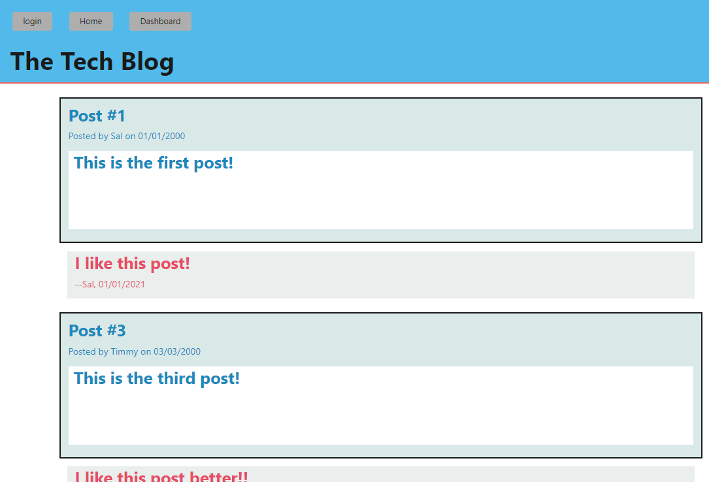

# Tech Blog

## Description

- The motivation to complete this challenge was to test my own skills gained in the most recent week of the coding bootcamp, including but not limited to: ORM, MVS, Handlebars, Serialization, Partials, Sessions, Session Storage, Authentication and Middleware.
- This project was built as a testing ground for my own retention of the aforementioned skills.
- This app allows a user or several users to post, delete, update and view not only their own blogs and ideas, but those belonging to others as well.
- Through building this application, I learnt that there are many programming skills outside of what we learn throughout the week, and that research and collaboration is critical in order to achieve the best outcome for any given project

## Installation

This can be installed to your computer by simply cloning this repository using the provided keys and URLs

To install Node.js please follow the instructions to install Node.js on your machine from the link below:
https://coding-boot-camp.github.io/full-stack/nodejs/how-to-install-nodejs

Dependencies:  \
bcrypt: ^5.1.0 \
connect-session-sequelize: ^7.1.5 \
dotenv: ^16.0.3 \
express: ^4.18.2 \
express-handlebars: ^6.0.7 \
express-session: ^1.17.3 \
mysql2: ^3.1.2 \
sequelize: ^6.29.0 

For testing purposes, this project also requires insomnia, which can be downloaded using the link below:
https://insomnia.rest/download

## Setup

1) Navigate to the database (db) folder in the root directory, sign into your mysql using 'mysql -u root -p' and entering your password, and run command 'SOURCE schema.sql'
2) Exit from mysql by typing 'exit' and hitting the 'enter' key. Once complete and you are back in gitBash, run command 'npm run seeds/seed.js' to seed the database you have just created.
3) Navigate to the root folder (if not there already), and run command 'npm start' to begin the app.

## Usage

App URL: \
https://warm-earth-74370.herokuapp.com/dashboard

- Login \
In the top left-hand corner of the app, click the "login" button.
- Create a New Account \
In the top left-hand corner of the app, click the "login" button. If you do not yet have an account, click the "Sign Up Instead" button and populate the name, email and password fields. Once complete select "Create!"
- See All Blogs \
Click the "Home" button.
- Comment on a Blog \
Click a blog anywhere in the homescreen, and populate the comment field when it appears before hitting "Submit!".
- See Personal Dashboard \
Click on the "Dashboard" button at the top of the screen.
- Create a Blog \
Click on the "Dashboard" button at the top of the screen, and click the "+ New Post" button. Once selected, populate the relevant fields.
- Update a Blog \
When in the Dashboard view, click one of your personal Blogs and you will be presented with the option to 'update' or 'delete' your post.

## License

MIT

## Testing
For testing blog features, please use account details below: \
Email: bob@gmail.com \
Password: password12345 

## Features

- Login / Logout / Account Creation
- Create a Blog
- Update a Blog
- Delete a Blog
- Comment on a Blog Post (Yours and Others)
- View Blog Posts from All Users

## How to Contribute

This repository is not open for public contribution.
